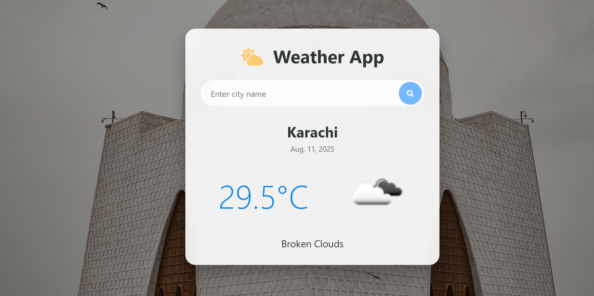
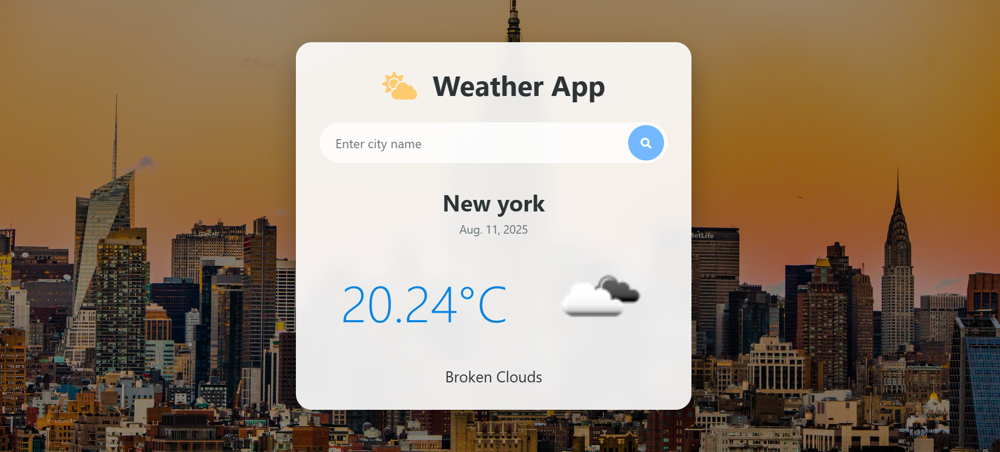

# 🌦 Simple Weather App (Django)

A simple weather web application built with **Django** that allows users to search for a city and view the current weather conditions.  
The app uses the **OpenWeatherMap API** for weather data and **Unsplash API** for dynamically fetching a background image of the searched city.

---

## 🚀 Features
- Search weather by **city name**
- Displays:
  - Temperature (°C)
  - Weather description
  - Current date
- Dynamic **background image** of the city (via Unsplash API)
- Default city: **Karachi**
- Responsive and simple UI

---

## 🛠 Technologies Used
- **Backend:** Django (Python)
- **Frontend:** HTML, CSS
- **APIs:**
  - [OpenWeatherMap API](https://openweathermap.org/api) — Weather Data
  - [Unsplash API](https://unsplash.com/developers) — City Images

---

## 📷 Screenshots

### Homepage – Default City (Karachi)

### Example – New York

---

## 🧑‍💻 Author
**Umaima Abdul Rauf**  
GitHub: [@itsmeumaima](https://github.com/itsmeumaima)
